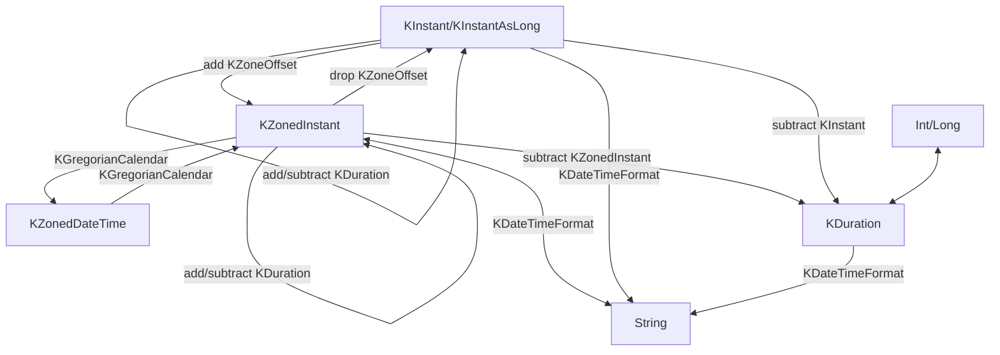

# Types

Public classes / objects:

- `KInstant` / `KInstantAsLong` (single point of time)
- `KZonedInstant` (single point of time + time zone offset)
- `KZoneOffset` (time zone offset)
- `KZonedDateTime` (date time + time zone offset)
- `KDuration` (a date-time length)
- `KFixedTimeUnit` (time unit)
- `KDateTimeFormat` (format and parse dates and times)
- `KGregorianCalendar` (conversion between timestamps and calendar dates)




Unlike Java, there is no local date or local datetime class here. That creates lots of usage issues. `KZonedInstant` or `KZonedDateTime` can be used instead.

There is also no time zone but time zone offset.

All of these classes are **thread-safe**, **serializable** and **parcelable**.

## Single point of time without timezone -- `KInstant`

Construct a `KInstant`.

```kotlin
val now = KInstant.now()
val specificTime = KInstant(timestampMs = 1694618242720)
```

Add a timezone offset to a `KInstant`.
```kotlin
val nowAtHKT1 = KInstant.now() at KZoneOffset(8, 0)
val nowAtHKT2 = KInstant.now().atZoneOffset(KZoneOffset(8, 0))
```

## Timezone Offset -- `KZoneOffset`

```kotlin
val zoneOffset = KZoneOffset(-7, 0)
println(zoneOffset) // -07:00

val localZoneOffset = KZoneOffset.local()
println(localZoneOffset) // +08:00

val anotherZoneOffset = KZoneOffset.parseFrom("+13:45")
```

## Single point of time with Timezone Offset -- `KZonedInstant`

Construct a `KZonedInstant`.

```kotlin
val nowAtLocalTime = KZonedInstant.nowAtLocalZoneOffset()
val nowAtJapanTime = KZonedInstant.nowAtZoneOffset(KZoneOffset(9, 0))
val sometimeAtJapanTime = KZonedInstant(timestampMs = 1694618242720, zoneOffset = KZoneOffset(9, 0))
```

Construct a `KZonedInstant` from `KInstant`.
```kotlin
val nowAtHKT1 = KInstant.now() at KZoneOffset(8, 0)
val nowAtHKT2 = KInstant.now().atZoneOffset(KZoneOffset(8, 0))
```

Remove the timezone offset.
```kotlin
val sometimeAtJapanTime = KZonedInstant(timestampMs = 1694618242720, zoneOffset = KZoneOffset(9, 0))
val withoutTimezoneOffset: KInstant = sometimeAtJapanTime.dropZoneOffset()
```

## Duration -- `KDuration`

There are many ways to create a `KDuration`.

```kotlin
val duration1: KDuration = 95.seconds()
val duration2: KDuration = KDuration.of(95, KFixedTimeUnit.Second)
val duration3: KDuration = KInstant(1694618242720) - KInstant(1694618242700) // 20 ms
```

## Calendar Date Time -- `KZonedDateTime`

When you need to manipulate dates and times according to a calendar, or need to express an extreme date time that cannot be represented by a timestamp, `KZonedDateTime` is a more suitable type.

```kotlin
val zonedDateTime = KZonedDateTime(
    year = 123456,
    month = 10,
    day = 4,
    hour = 13,
    minute = 8,
    second = 40,
    zoneOffset = KZoneOffset.parseFrom("+08:00")
)
```

To modify an individual field:
```kotlin
val zonedDateTime = KZonedDateTime(
    year = 2023,
    month = 10,
    day = 4,
    hour = 13,
    minute = 8,
    second = 40,
    zoneOffset = KZoneOffset.parseFrom("+08:00")
)
val nextMonth = zonedDateTime.copy(month = 11)
```

Convenience functions:
```kotlin
val midnight = zonedDateTime.startOfDay()
```
